:icons: font
:toc: left
:toclevels: 3

== Matplotlib examples

=== plot 2D

==== Plot of Sine

[source,python]
.matplotlib_plot_sin_show.py
----
import numpy as np
import matplotlib.pyplot as plt

x = np.arange(-10.0, 10.0, 0.1)
y = np.sin(x)
plt.plot(x, y)
plt.show()
----

[source,python]
.matplotlib_plot_sin_save_png.py
----
import numpy as np
import matplotlib.pyplot as plt

x = np.arange(-10.0, 10.0, 0.1)
y = np.sin(x)
plt.plot(x, y)
plt.savefig('matplotlib_plot_sin.png')
----

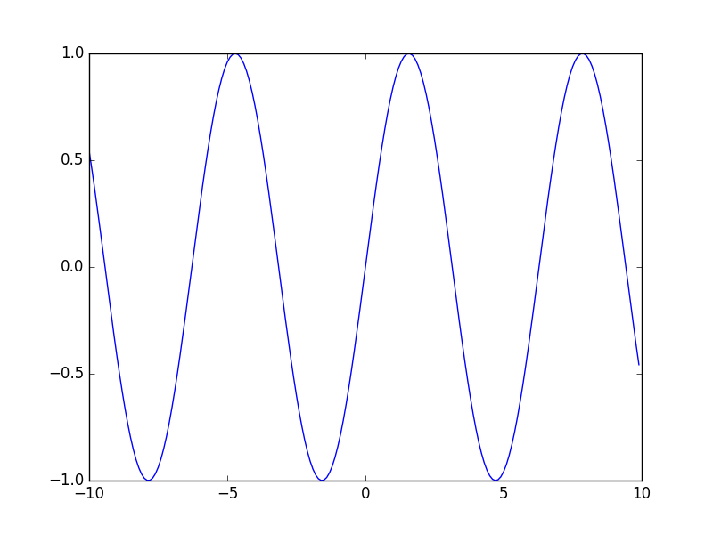

==== Random points

[source,python]
.matplotlib_plot_random_point_diagram.py
----
import numpy as np
import matplotlib.pyplot as plt

x = np.random.randn(30)
y = np.sin(x) + np.random.randn(30)
plt.plot(x, y, "o")  # "o"は小さい円(circle marker)
plt.savefig('matplotlib_plot_random_point_diagram.png')
----

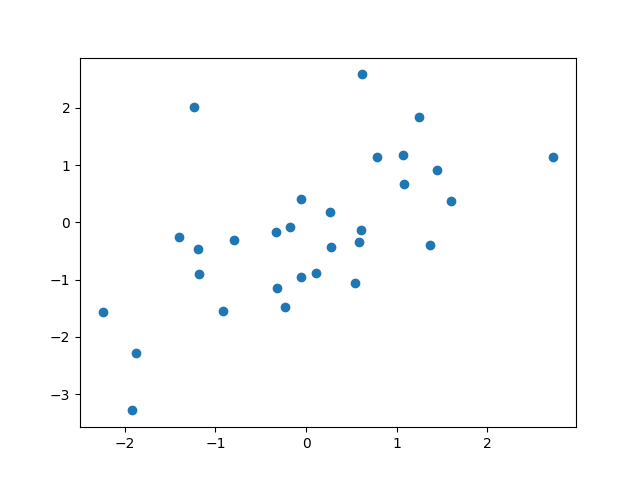

==== Random lines

[source,python]
.matplotlib_plot_random_line_graph.py
----
import numpy as np
import matplotlib.pyplot as plt

x = np.random.randn(30)
y = np.sin(x) + np.random.randn(30)
plt.plot(x, y)  # "o"は小さい円(circle marker)
plt.savefig('matplotlib_plot_random_line_graph.png')
----

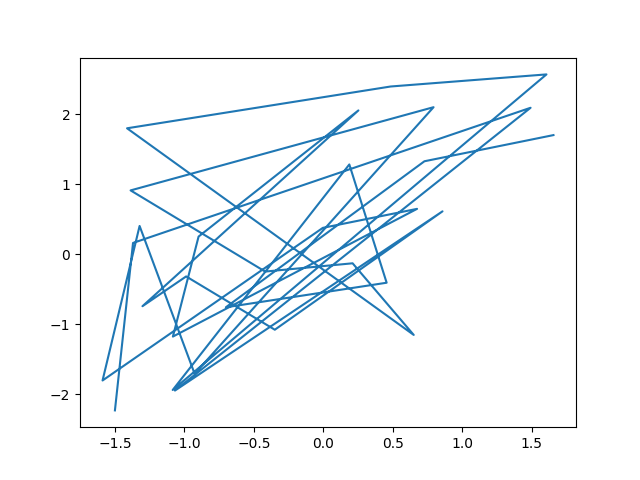

=== Plot 3D

==== 3D wireframe plot
[source,python]
.matplotlib_plot3d_wireframe.py
----
import matplotlib.pyplot as plt
import numpy as np

x = np.arange(-3, 3, 0.25)
y = np.arange(-3, 3, 0.25)
X, Y = np.meshgrid(x, y)
Z = np.sin(X) + np.cos(Y)

fig = plt.figure()
ax = fig.add_subplot(111, projection='3d')
ax.plot_wireframe(X, Y, Z)

plt.show()
----

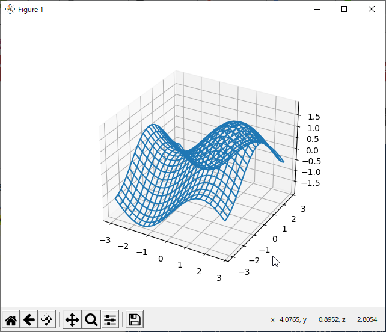

==== Plot contour

[source,python]
.matplotlib_plot_contour.py
----
import math
import numpy

import matplotlib.cm
import matplotlib
matplotlib.use('Agg')
import matplotlib.pyplot

def func_d1(p_x):
    """Euclidean distance."""
    return numpy.sqrt(p_x[1:]*p_x[1:] + p_x[:-1]*p_x[:-1])

def func_d2(p_x):
    """func z."""
    return numpy.absolute(p_x[1:]) * numpy.absolute(p_x[:-1])

def func_d3(p_x):
    """func z."""
    return numpy.absolute(p_x[1:]) + numpy.absolute(p_x[:-1])

def main():
    """main."""
    levels = [-math.sqrt(2), -1, -0.5, 0, 0.5, 1, math.sqrt(2)]

    delta = 0.025
    x_seq = numpy.arange(-2.0, 2.0, delta)
    y_seq = numpy.arange(-2.0, 2.0, delta)
    grid_x, grid_y = numpy.meshgrid(x_seq, y_seq)

    fig = matplotlib.pyplot.figure(1, (9., 2*6.))
    ax1 = fig.add_subplot(2, 1, 1)
    ax2 = fig.add_subplot(2, 1, 2)

    p_z = func_d1(
        numpy.vstack([grid_x.ravel(), grid_y.ravel()])
    ).reshape(len(x_seq), len(y_seq))
    ax1.set_aspect('equal')
    cs_plot = ax1.contour(grid_x, grid_y, p_z, levels)
    cbar = fig.colorbar(
        cs_plot,
        cax=matplotlib.pyplot.axes([0.85, 0.1, 0.075, 0.8])
    )
    cbar.ax.set_ylabel('verbosity coefficient')
    ax1.clabel(cs_plot, inline=1, fontsize=10)

    p_z = func_d2(
        numpy.vstack([grid_x.ravel(), grid_y.ravel()])
    ).reshape(len(x_seq), len(y_seq))
    ax2.set_aspect('equal')
    cs_plot = ax2.contour(grid_x, grid_y, p_z, levels)
    ax2.clabel(cs_plot, inline=1, fontsize=10)
    cbar = matplotlib.pyplot.colorbar(cs_plot, cax=ax2)
    cbar.ax.set_ylabel('verbosity coefficient')
    matplotlib.pyplot.savefig('matplotlib_plot_contour_2.png'
----

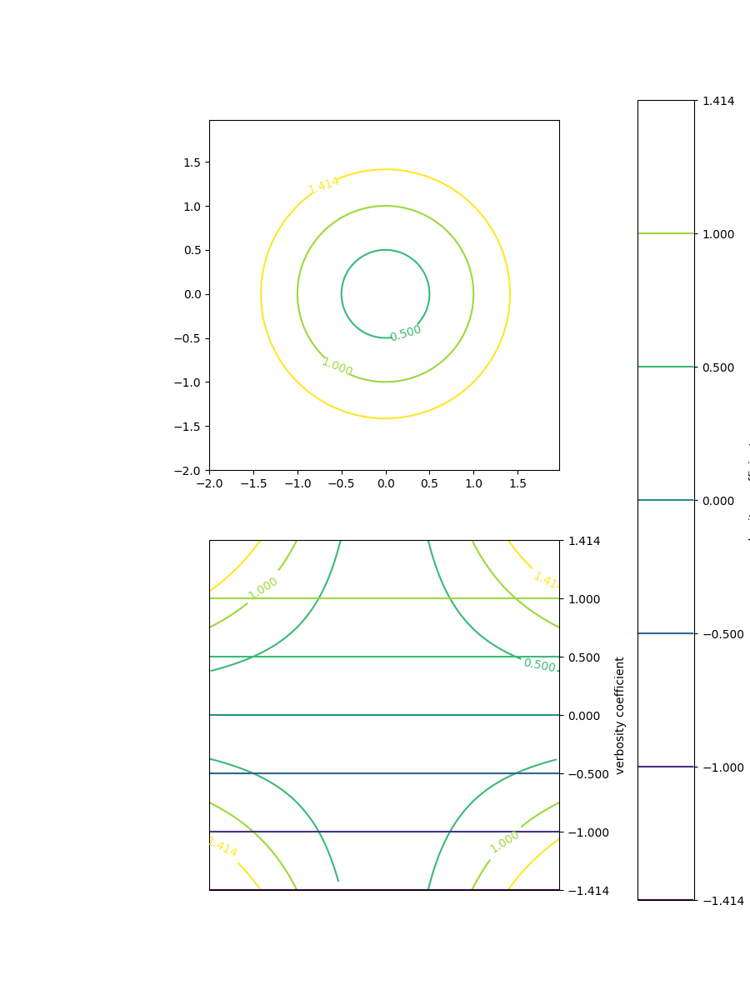

==== Rastrigin function
[source,python]
.matplotlib_plot3d_rastrigin.py
----
from matplotlib import cm
import numpy as np
import matplotlib.pyplot as plt

x = np.linspace(-5.12, 5.12, 100)
y = np.linspace(-5.12, 5.12, 100)
x, y = np.meshgrid(x, y)
z = 20 + x**2 - 10 * np.cos(2 * np.pi * x) + y**2 - 10 * np.cos(2 * np.pi * y)

figure = plt.figure()
axe = figure.add_subplot(111, projection='3d')
surface = axe.plot_surface(
    x, y, z,
    rstride=1, cstride=1,
    cmap=cm.winter, linewidth=0, antialiased=False
)

# figure.savefig("matplotlib_plot3d_rastrigin.png")
plt.show()
----

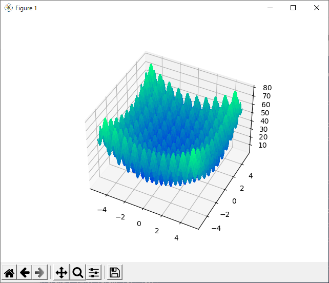

=== Streamplot

==== Examples 1
[source,python]
.matplotlib_plot_stream1.py
----
import numpy as np
import matplotlib.pyplot as plt

x, y = np.linspace(-3, 3, 100), np.linspace(-3, 3, 100)
X, Y = np.meshgrid(x, y)
U = -1 - X**2 + Y
V = 1 + X - Y**2
speed = np.sqrt(U*U + V*V)

start = [[0, 0], [1, 2]]

fig0, ax0 = plt.subplots()

ax0.streamplot(
    x, y, U, V, color=(.75, .90, .93)
)
ax0.streamplot(
    x, y, U, V, start_points=start, color="crimson", linewidth=2
)

plt.show()
----

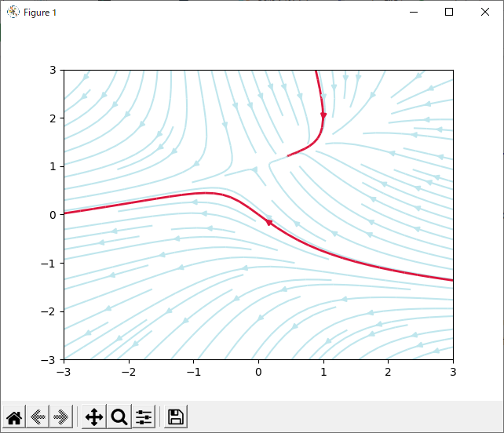

==== Examples 2

[source,python]
.matplotlib_plot_stream2.py
----
import numpy as np
import matplotlib.pyplot as plt

# Data
x = np.linspace(-10, 10, 10)
y = np.linspace(-10, 10, 10)
X, Y = np.meshgrid(x, y)
U = X*0 + 1
V = X*0
start_points = [[0, 0]]

# Base streamline plot
plt.figure()
sp1 = plt.streamplot(x, y, U, V, color=[.5]*3)

# Streamline plot with 'start_points' argument
sp2 = plt.streamplot(x, y, U, V, start_points=start_points,
                     color='r')
plt.plot(*start_points[0], marker='o', label="Starting point")
plt.plot([], [], color='r', label="Associated streamline")

# Legend and limits
plt.xlim(-10, 10)
plt.ylim(-10, 10)
plt.legend(numpoints=1)

plt.show()
----

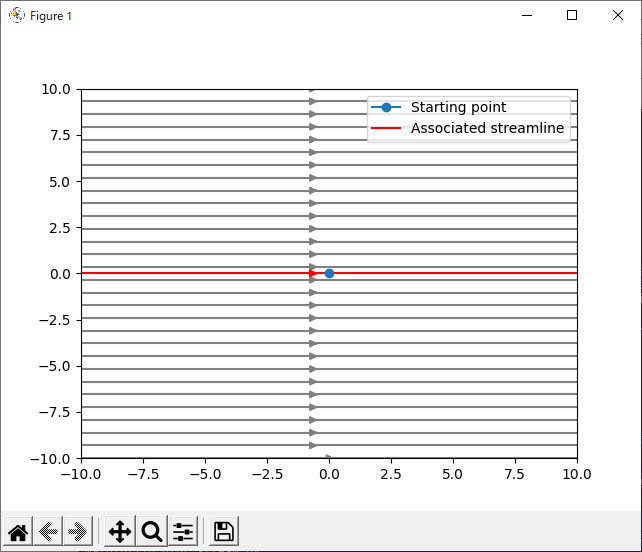

==== Examples 3

[source,python]
.matplotlib_plot_stream3.py
----
import numpy as np
import matplotlib.pyplot as plt

X, Y = (np.linspace(-3, 3, 100), np.linspace(-3, 3, 100))

U, V = np.mgrid[-3:3:100j, 0:0:100j]

seed_points = np.array([[-2, 0, 1], [-2, 0, 1]])
print(seed_points)

fig0, ax0 = plt.subplots()
stream_plot = ax0.streamplot(
    X, Y, U, V, color=U, linewidth=2,
    cmap=plt.cm.autumn, start_points=seed_points.T
)
fig0.colorbar(stream_plot.lines)

ax0.plot(seed_points[0], seed_points[1], 'bo')

ax0.axis((-3, 3, -3, 3))

plt.show()
----

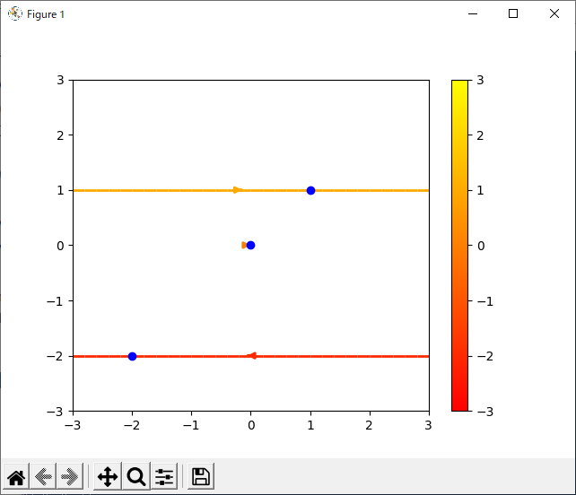

=== Animation

[%collapsible]
====
[source,python]
.matplotlib_plot_animate_decay.py
----
import numpy as np
import matplotlib.pyplot as plt
import matplotlib.animation as animation

fig, ax = plt.subplots()
line, = ax.plot([], [], lw=2)
ax.grid()
x_data, y_data = [], []

def data_gen(t=0):
    cnt = 0
    while cnt < 1000:
        cnt += 1
        t += 0.1
        yield t, np.sin(2*np.pi*t) * np.exp(-t/10.)

def init():
    ax.set_ylim(-1.1, 1.1)
    ax.set_xlim(0, 10)
    del x_data[:]
    del y_data[:]
    line.set_data(x_data, y_data)
    return line,

def update(data):
    # update the data
    t, y = data
    x_data.append(t)
    y_data.append(y)
    x_min, x_max = ax.get_xlim()

    if t >= x_max:
        ax.set_xlim(x_min, 2*x_max)
        ax.figure.canvas.draw()
    line.set_data(x_data, y_data)

    return line,

if __name__ == '__main__':
    ani = animation.FuncAnimation(
        fig, update, data_gen, blit=False, interval=10,
        repeat=False, init_func=init)
    plt.show()
----
====

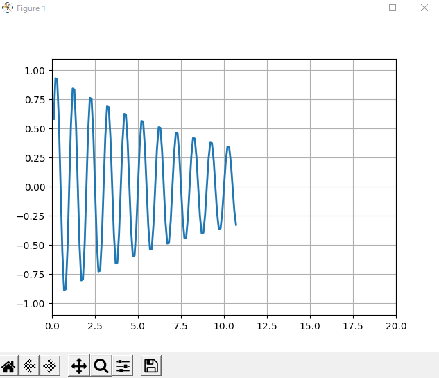

video::images/matplotlib_plot_animate_decay.webm[]

=== Plot NetworkX
.Requirements
* graphviz-dev
* PyGraphviz (pip)

[source,python]
.matplotlib_plot_networkx_01.py
----
import matplotlib.pyplot as plt
import networkx
from networkx.drawing.nx_agraph import graphviz_layout

def show(nx_g):
    """Show graph"""
    text_font = "sans-serif"
    node_alpha = 0.4
    pos = graphviz_layout(nx_g, prog="circo")
    networkx.draw_networkx_nodes(
        nx_g, pos, node_color="pink", alpha=node_alpha+0.5
    )
    networkx.draw_networkx_edges(
        nx_g, pos, edge_color="blue", alpha=node_alpha, arrows=False
    )
    networkx.draw_networkx_labels(
        nx_g, pos, font_size=12, font_family=text_font
    )
    plt.savefig("matplotlib_plot_networkx_01.png")

if __name__ == '__main__':
    G = networkx.Graph()
    G.add_nodes_from(['A', 'C', 'B', 'E', 'D', 'G', 'F', 'I', 'H'])
    G.add_edges_from(
        [
            ('A', 'I'), ('A', 'C'), ('A', 'B'), ('C', 'F'),
            ('B', 'D'), ('E', 'F'), ('D', 'G'), ('G', 'H')
        ]
    )
    show(G)
----

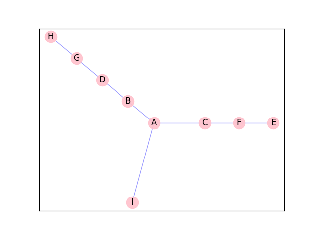
